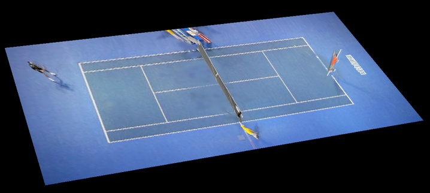
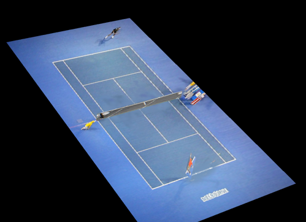
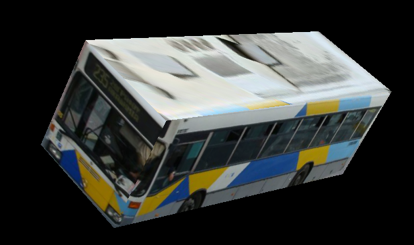
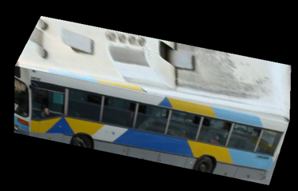

# sp19-ece549-Computer_Vision-Project
The aim of this project is to construct 3D model from single-view metrolopy (SVM). In fact, we use homography and vanishing points to acquire each plane (i.e. XY, XZ and YZ). Then, we use OpenGL to draw our 3D models. Moreover, by utilize Mask R-CNN, we can make the whole process automatically.

## Part 1 (basic version):
Use SVM to reconstruct our target. The method is based on [this link](https://github.com/kalyanghosh/3D-Reconstruction-using-Single-View-Metrology).


### Result 1:




## Part 2 (automatic version):
Use Mask R-CNN to detect all edges of the target. Notice that the object must be cuboid. And, the method is based on [this link](https://github.com/matterport/Mask_RCNN). We improve and combine the whole process by detecting edges and estimating points.


### Result 2:




## Youtube videos
[](https://www.youtube.com/watch?v=vJj32U-ZawM)

[](https://www.youtube.com/watch?v=1YJnzVArV38)

## Citation
Welcome to discuss with us.
```
@misc{uiuc_ece549_sp19,
  title={Automatically 3D reconstruction by single-view metrolopy and Mask R-CNN},
  author={Bo-Rong Chen, Hsiu-Yao Chang, and Hsin-Yu Hou},
  year={2019},
  publisher={Github},
  journal={GitHub repository},
  howpublished={\url{https://github.com/bydottck13/sp19-ece549-Computer_Vision}},
}
```

## Reference
* [Project](http://slazebni.cs.illinois.edu/spring19/project.html)
* [Single-View-Metrology](https://github.com/kalyanghosh/3D-Reconstruction-using-Single-View-Metrology)
* [Mask R-CNN](https://github.com/matterport/Mask_RCNN)